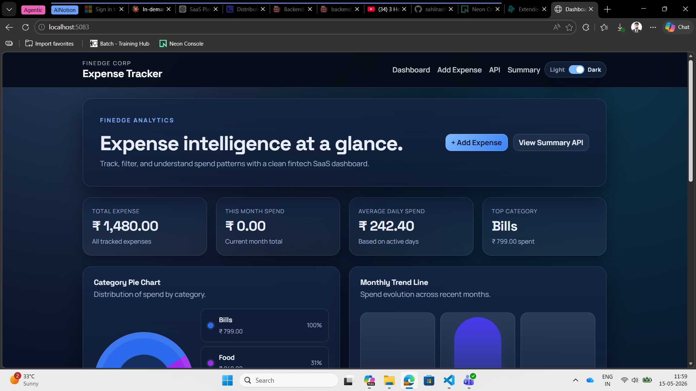
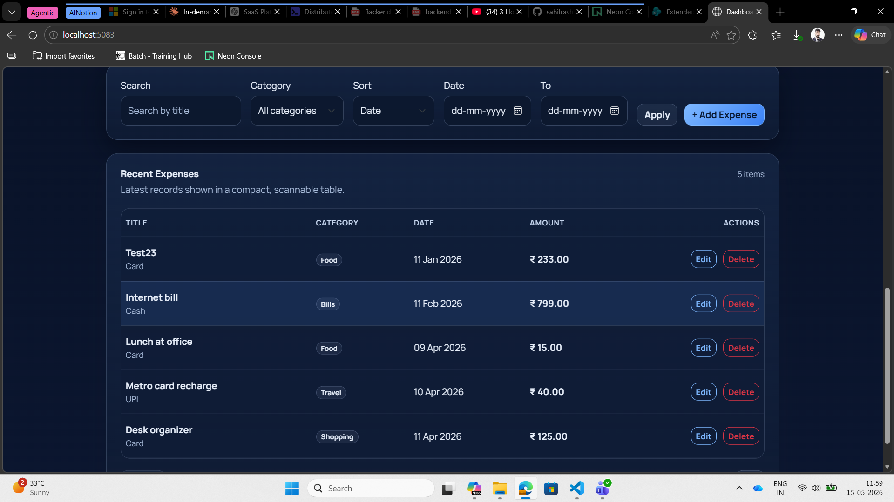
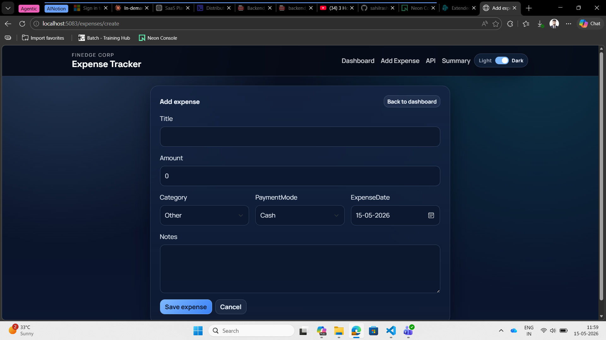

# Expense Tracker

Expense Tracker is an ASP.NET Core web app that combines a REST API with a Razor UI for managing employee expenses. It stores data in a JSON file, supports filtering and pagination, and includes summary analytics for quick spending insight.

## Highlights

- Full expense CRUD through the API and the Razor UI
- Dashboard with totals, category breakdowns, and monthly trends
- Search, category filtering, date range filtering, sorting, and pagination
- JSON file persistence with optional seed data on startup
- Global exception handling and request logging middleware
- Automated integration tests for the main expense workflows

## Screenshots

### Home Dashboard


### Summary API


### Analytics Dashboard


## Tech Stack

- .NET 10 / ASP.NET Core
- Razor Views
- REST API controllers
- xUnit integration tests

## Getting Started

### Prerequisites

- .NET 10 SDK

### Restore and test

```bash
dotnet restore
dotnet test ExpenseTracker.slnx
```

### Run the app

```bash
dotnet run --project ExpenseTracker.Api
```

Then open the app in your browser at the local URL shown by the terminal.

## Configuration

The app supports two useful settings in `ExpenseTracker.Api/appsettings.json` or `appsettings.Development.json`:

- `ExpenseStorePath` controls where the JSON data file is stored.
- `EnableSeedData` controls whether sample expenses are loaded on startup.

By default, expenses are stored in `ExpenseTracker.Api/App_Data/expenses.json`.

## API Endpoints

### Expenses

- `GET /expenses` - list expenses with query support
- `GET /expenses/{id}` - get one expense
- `POST /expenses` - create a new expense
- `PUT /expenses/{id}` - update an expense
- `DELETE /expenses/{id}` - delete an expense

### Summary

- `GET /expenses/summary` - expense totals by category and month

## Razor Pages

- `GET /` - dashboard
- `GET /expenses/create` - create expense form
- `GET /expenses/edit/{id}` - edit expense form

## Expense Model

- `Id` - `Guid`
- `Title` - required
- `Amount` - required and greater than zero
- `Category` - `Food`, `Travel`, `Bills`, `Shopping`, `Other`
- `ExpenseDate` - `DateTime`
- `PaymentMode` - `Cash`, `Card`, `UPI`
- `Notes` - optional
- `CreatedAt` - generated automatically

## Verification

The solution builds and all tests pass with `dotnet test ExpenseTracker.slnx`.